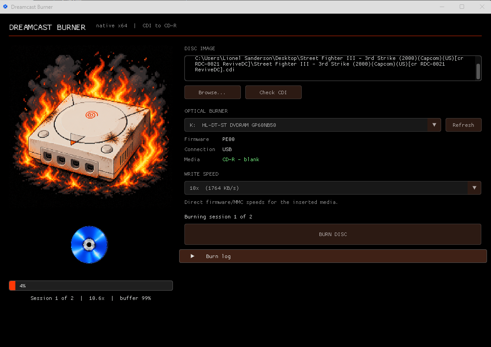
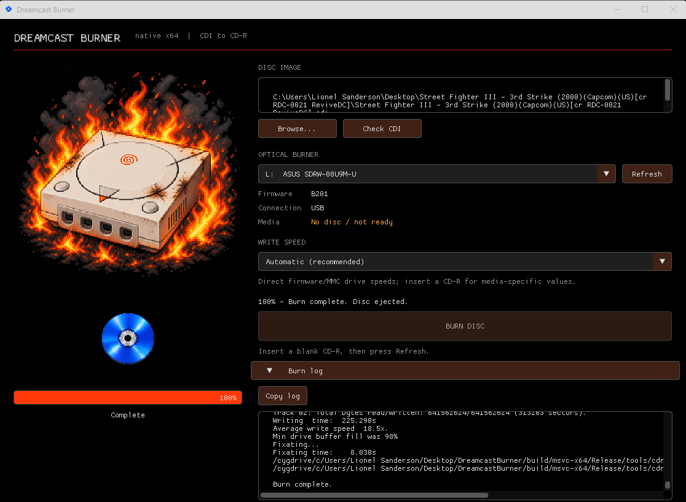

# Dreamcast Burner

**Dreamcast Burner** is a native Windows GUI for burning Sega Dreamcast **DiscJuggler CDI images** to CD-R.

It provides a modern front end around the existing open-source command-line tools required to extract and record Dreamcast CDI images, with automatic drive/media detection, burn progress, logging and sensible Dreamcast-specific defaults.

The application does **not** implement its own CD recording engine.

Instead, Dreamcast Burner acts as a GUI / frontend / wrapper around **CDIrip** and **cdrecord**, handling the workflow and presenting their functionality through a simple Windows interface.

**Current version: 0.3.0**

---

## Features

* Native Windows application.
* Modern GUI built with **Dear ImGui** and DirectX 11.
* Open and burn DiscJuggler `.cdi` Dreamcast images.
* Automatic detection of installed optical writers.
* Displays optical drive model and firmware revision.
* Queries the selected drive before burning.
* Reads inserted CD-R media information.
* Displays detected media/manufacturer information where available.
* Checks the disc before starting a burn.
* Dreamcast CDI structure detection.
* Supports multi-session/self-boot Dreamcast CDI images.
* Supports common Data+Data and Audio+Data Dreamcast self-boot layouts.
* Uses the installed cdrecord backend's real device scan to map multiple optical writers reliably.
* Automatically extracts CDI sessions and tracks using CDIrip.
* Automatically invokes cdrecord with the required track/session parameters.
* Burn speed selection based on the capabilities exposed by the drive/backend.
* Automatic/default speed option.
* Live extraction progress.
* Live burn progress.
* Overall percentage display.
* Animated disc while an actual burn is in progress.
* Disc remains static while idle.
* Captures output from the underlying burning tools.
* Detailed burn log available for troubleshooting.
* Reports hardware/media errors returned by cdrecord rather than hiding them.
* Automatically handles session sequencing.
* Ejects the completed disc when the burn finishes successfully.
* Temporary extracted files are managed automatically.
* No separate command-line work is normally required.

---

## Supported Images

The current Dreamcast Burner workflow is designed for:

```text
DiscJuggler CDI (.cdi)
```

including common Dreamcast self-boot layouts such as:

```text
Session 1 - data
Session 2 - data
```

The underlying recording tools are technically capable of considerably more than this, but **Dreamcast Burner intentionally exposes only the workflow required for Dreamcast CDI burning**.

Other disc image formats are not currently considered supported by the GUI.

---

## How It Works

Dreamcast Burner coordinates several existing components.

The basic process is:

```text
Dreamcast CDI
     |
     v
  CDIrip
     |
     +--> Session / track extraction
     |
     v
 Dreamcast Burner
     |
     +--> drive and media preflight
     +--> session sequencing
     +--> progress monitoring
     +--> error handling
     |
     v
  cdrecord
     |
     v
   CD-R
```

### 1. CDI extraction

Dreamcast CDI images are parsed using **CDIrip**.

CDIrip identifies the sessions and tracks contained in the DiscJuggler image and extracts the data required for recording.

### 2. Drive and media preflight

Before burning, Dreamcast Burner uses the recording backend to query the selected optical drive and inserted media.

Depending on what the drive reports, this can include:

* drive manufacturer
* drive model
* firmware revision
* supported recording modes
* CD-R/CD-RW capability
* inserted media type
* ATIP information
* media manufacturer
* recording capabilities

This lets the GUI check the burner and blank disc before starting the write operation.

### 3. Recording

The extracted tracks are passed to **cdrecord**.

Dreamcast Burner launches the required recording commands, monitors their output and handles each CDI session in the correct order.

### 4. Progress

Output from CDIrip and cdrecord is parsed by Dreamcast Burner and presented through the GUI as extraction and burn progress.

The command-line tools remain the components actually performing CDI extraction and disc recording.

---

## Third-Party Software

Dreamcast Burner is built using and/or distributed alongside several open-source projects.

These projects remain the property of their respective authors and are distributed according to their own licences.

### Dear ImGui

Dreamcast Burner's user interface is built using **Dear ImGui**.

Upstream project:

```text
Dear ImGui
Copyright (c) Omar Cornut and Dear ImGui contributors
```

The exact Dear ImGui revision bundled with a source tree can be checked in:

```text
external/imgui/imgui.h
```

using the `IMGUI_VERSION` definition.

Dear ImGui is distributed under the **MIT License**.

A copy of its licence is included with source/binary distributions where applicable.

```text
licenses/DearImGui-LICENSE.txt
```

### CDIrip

CDI extraction is performed using **CDIrip**.

The bundled program identifies itself as:

```text
CDIrip
Copyright (C) 2004 DeXT / Lawrence Williams
```

CDIrip is open-source software distributed under the **GNU General Public License version 2**.

Dreamcast Burner does not claim ownership of CDIrip.

The CDIrip source used to build the bundled executable is located under:

```text
external/cdirip/
```

Its licence is included as:

```text
licenses/CDIrip-GPL-2.0.txt
```

### cdrecord

Physical disc recording is performed by **cdrecord**.

The currently bundled build identifies itself as:

```text
Cdrecord-ProDVD-ProBD-Clone 2.01.01a36
Copyright (C) 1995-2007 Jörg Schilling
```

Dreamcast Burner launches cdrecord as a separate executable and parses its console output.

Dreamcast Burner does not contain or claim ownership of the cdrecord recording engine.

The licence texts supplied with the bundled cdrecord distribution are included under:

```text
licenses/cdrecord-CDDL.txt
licenses/cdrecord-GPL.txt
```

Refer to those files and the corresponding upstream source distribution for the licensing terms applying to the bundled cdrecord components.

### Cygwin Runtime

The bundled cdrecord Windows executable uses the Cygwin runtime:

```text
tools/cygwin1.dll
```

The applicable Cygwin/GPL licence information is included as:

```text
licenses/Cygwin-GPL-2.0.txt
```

Cygwin is a third-party project and is not part of the original Dreamcast Burner source code.

---

## Important Licensing Note

**Dreamcast Burner is a frontend.**

The original Dreamcast Burner GUI, drive-management, process-management and supporting source code may be distributed under the **MIT License**.

That licence applies only to code original to the Dreamcast Burner project.

It does **not** relicense third-party software bundled with or used by Dreamcast Burner.

In particular:

* Dear ImGui remains under its MIT licence.
* CDIrip remains under GPL-2.0.
* cdrecord remains under the licence terms supplied with that software.
* Cygwin remains under its applicable licence terms.

When redistributing Dreamcast Burner, retain the relevant third-party copyright notices, licence files and any source-code availability obligations required by those projects.

See:

```text
licenses/
external/
THIRD_PARTY.md
```

for further information.

---

## Dreamcast Burner License

The original Dreamcast Burner source code is released under the **MIT License**.

In short, you are free to:

* use it
* copy it
* modify it
* redistribute it
* use it in commercial or non-commercial projects

provided the MIT copyright and licence notice is retained.

See:

```text
LICENSE
```

for the complete licence.

Third-party components are excluded from this grant and remain under their respective licences as described above.

---

## Requirements

### Running

* Windows 10 or Windows 11
* Compatible CD/DVD writer capable of writing CD-R media
* Blank CD-R
* Dreamcast DiscJuggler `.cdi` image

A good-quality CD-R is strongly recommended.

Old, scratched, dirty or poorly stored blank media can produce write errors even when the application, burner and image are functioning correctly.

A write failure reported by Dreamcast Burner generally means the underlying recording tool or optical drive reported a failure. The full backend output can be viewed in the burn log.

---

## Building From Source

### Requirements

* Windows
* Visual Studio 2022
* Desktop development with C++
* CMake 3.24 or newer
* PowerShell

Dreamcast Burner uses C++20.

### Dependencies

Dear ImGui is stored under:

```text
external/imgui/
```

CDIrip source is stored under:

```text
external/cdirip/
```

The required Windows cdrecord files are stored under:

```text
tools/
```

If Dear ImGui has not yet been downloaded, run:

```powershell
.\scripts\bootstrap-deps.ps1
```

Then build the Release version with:

```powershell
.\build-release.bat
```

The build system uses the Visual Studio 2022 x64 generator and produces the native Windows executable together with the required runtime tools.

---

## Project Layout

```text
DreamcastBurner/
│
├── Images/
│   └── dreamcastburner.png
│
├── src/
│   ├── main.cpp
│   ├── burn_engine.cpp
│   ├── burn_engine.h
│   ├── drive_manager.cpp
│   ├── drive_manager.h
│   ├── texture_loader.cpp
│   └── texture_loader.h
│
├── external/
│   ├── imgui/
│   └── cdirip/
│
├── tools/
│   ├── cdrecord.exe
│   └── cygwin1.dll
│
├── licenses/
│
├── scripts/
│
├── CMakeLists.txt
├── README.md
├── THIRD_PARTY.md
└── LICENSE
```

---

## Troubleshooting

### Burn reaches a high percentage and then fails

This can be caused by the CD-R itself.

Optical drives can encounter a physical write error late in a burn even after hundreds of megabytes have been written successfully.

Try:

* another CD-R
* a cleaner disc
* another brand of media
* checking the burn log for `Medium Error`, `Write Error` or similar drive responses

A failed disc should not normally be reused.

### The available write speeds seem unusual

Modern DVD writers frequently expose only a limited set of speeds when writing CD-R media.

A drive whose minimum practical CD-R speed is around 10x, for example, cannot necessarily be forced to write at the traditional 1x/2x/4x speeds associated with older Dreamcast burning guides.

The drive, firmware and inserted media ultimately determine which recording speeds are possible.

### A burn fails but the GUI reaches 100%

The percentage represents the progress reported by the extraction/recording process.

A disc can finish transferring its track data and still fail during the final write, flush or fixation stage.

Dreamcast Burner therefore uses the final result reported by the backend rather than assuming that reaching 100% means the disc was successfully completed.

---

## Disclaimer

Dreamcast Burner is an independent community project.

It is **not affiliated with, endorsed by, sponsored by, or produced by Sega Corporation**.

Dreamcast, the Dreamcast name, logos and associated trademarks are the property of their respective owners.

This software is intended for use with disc images that you are legally entitled to use.

No Sega software, BIOS files, game data or copyrighted Dreamcast game images are included with Dreamcast Burner.

---

## Credits

Dreamcast Burner brings together work from several open-source projects.

Special thanks to:

* **Omar Cornut and Dear ImGui contributors** — Dear ImGui
* **DeXT / Lawrence Williams** — CDIrip
* **Jörg Schilling and contributors** — cdrecord / associated recording tools
* **Cygwin contributors** — Windows POSIX compatibility runtime
* everyone still burning Dreamcast CD-Rs decades later

---

## Status

Dreamcast Burner has been tested with real Dreamcast CDI images, physical optical writers and real CD-R media.
