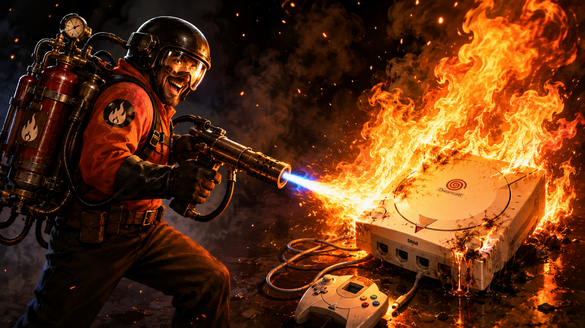

# Retro Burner

Retro Burner is a native Windows optical-disc burning frontend for classic game consoles. The aim is simple: historically, people have needed a collection of different applications, command lines and console-specific guides to burn game discs. **Retro Burner aims to become the one-for-all tool for those workflows** while still exposing enough backend choice and logging to troubleshoot difficult drive/media combinations.

**Current development version: 0.4.0**

> **0.4.0 is not released yet.** The public repository is still on 0.3.0. This README describes the 0.4.0 release candidate and clearly labels features that still need physical validation.

Retro Burner is intended only for images and backups that you are legally entitled to use.

## Supported console profiles

| Console | Image format | Recording path | 0.4.0 status |
| --- | --- | --- | --- |
| Dreamcast | CDI | CDIrip + RetroBeam | Physically tested |
| PlayStation | BIN/CUE | RetroBeam CUE/SAO | Physically tested |
| PlayStation 2 CD | BIN/CUE or ISO | RetroBeam | Implemented; final regression test pending |
| PlayStation 2 DVD | ISO, DVD5/DVD9 | RetroBeam or growisofs + dvd+rw-mediainfo | DVD5 physically tested; DVD9 implemented but not physically validated |
| Sega Saturn | BIN/CUE | RetroBeam CUE/SAO | Implemented; final regression test pending |
| Xbox 360 XGD2 | ISO to DVD+R DL | RetroBeam or growisofs | Implemented; physical validation pending |
| Xbox 360 XGD3 | ISO to DVD+R DL | image verification/preparation + BurnerMAX path + selected DVD backend | **Experimental; end-to-end burn currently untested** |

If there is a legitimate optical-disc workflow Retro Burner does not cover, feature requests are welcome.

## Highlights

- Native C++20 Windows application using Dear ImGui and DirectX 11.
- One console/profile selector instead of separate burning applications.
- Automatic optical writer, firmware and inserted-media detection.
- Real write-speed choices reported by the drive/media where available.
- Read-only media preflight before writing.
- **Live graphical burn monitoring** with overall progress, actual write speed, remaining time, host/read-buffer and optical drive-buffer bars.
- Automatic eject and completion sound after a successful burn.
- Capability-driven Advanced Settings for BURN-Free, Force Speed, OPC, MMC streaming/rotation policy and drive-buffer reporting.
- RetroBeam as the default recording backend, with **growisofs retained as an optional DVD backend** for PS2 DVD and Xbox 360 workflows.
- Backend-aware monitoring keeps the UI consistent: RetroBeam supplies its FIFO/read and drive-buffer data, while growisofs `RBU`/`UBU` output is parsed into the same graphical **Buffer** and **Device Buffer** bars.
- Single-EXE release design, subject to the licence terms of each bundled helper.

## Recording backends: choice, not a universal ranking

RetroBeam is the default because it gives Retro Burner direct control over the recording path and detailed SPTI/buffer diagnostics. growisofs remains selectable for supported DVD profiles so users can compare behaviour on their own hardware.

The two backends report progress differently internally, but Retro Burner presents them through a consistent burn UI. RetroBeam's FIFO/read-buffer and drive-buffer reporting drives the graphical **Buffer** and **Device Buffer** bars. For growisofs, Retro Burner parses its `RBU` and `UBU` values into those same bars, along with live percentage, actual write speed and estimated remaining time. growisofs phase output is also translated into cleaner status messages such as **Writing Lead-In**, **Writing Sectors** and **Finalising Disc**.

A result on one development system is **not** a universal statement that one backend is better than another. Optical recording depends on several variables at once, including:

- burner model and firmware
- USB/SATA bridge and connection quality
- recordable-media brand, MID and batch quality
- selected write speed and drive write strategy
- console model and the condition/calibration of its optical pickup

That is why Retro Burner presents the backend as a user choice rather than pretending one test machine can determine the best engine for everyone.

## Console workflows

### Dreamcast CDI

Dreamcast DiscJuggler images are extracted with CDIrip and recorded with RetroBeam. The tested self-boot Data+Data and Audio+Data workflows are retained.

Retro Burner asks CDIrip for the required conversion without using CDIrip's `-cdrecord` preset, because that preset also enables track cutting that can damage audio tracks.

### PlayStation, PlayStation 2 CD and Sega Saturn

BIN/CUE images use RetroBeam's CUE/SAO path. PlayStation BIN/CUE burning has been physically tested. PS2 CD and Sega Saturn profiles are implemented and need final 0.4.0 regression testing on physical hardware/media.

### PlayStation 2 DVD

PS2 DVD ISO images can be recorded with RetroBeam or the optional growisofs backend. `dvd+rw-mediainfo` is used for read-only media/capacity interrogation.

- DVD5 recording has been physically tested on a real PlayStation 2.
- DVD9 handling and layer-break calculation are implemented but still require a physical release-validation burn.
- Backend choice is preserved specifically because different drive/media combinations may behave differently.

### Xbox 360 XGD2

XGD2 uses DVD+R DL and the standard layer break:

```text
1913760
```

The workflow is implemented but should remain marked as physically unverified until a release-validation disc is completed.

### Xbox 360 XGD3 — experimental

XGD3 requires a correctly prepared image plus enough writable DVD+R DL capacity. Retro Burner's development workflow performs image preparation/verification, blank-media checks, BurnerMAX-capacity checks and then records with the selected compatible DVD backend using layer break:

```text
2133520
```

The original source ISO is never modified; any preparation is performed on a temporary working copy.

**Important 0.4.0 test status:** during development, the HL-DT-ST GP60NB50/PE00 test drive successfully accepted the BurnerMAX payload and exposed the expanded-capacity state, but the subsequent XGD3 recording did not proceed. The drive was later rendered unusable during separate manual firmware experimentation while investigating compatibility. That firmware incident was **not caused by a Retro Burner disc write**, but it removed the only available test drive before a complete XGD3 disc could be validated.

As a result, **XGD3 titles remain end-to-end untested in Retro Burner**. Compatible burners are on the way for continued validation, including Lite-On iHAS hardware and cross-flash-compatible drives intended to use permanent C4EVA firmware. XGD3 should remain labelled experimental until those real burns are completed and verified on console.

### Native BurnerMAX status

Retro Burner contains a native interoperability module based on the publicly documented/researched BurnerMAX command behaviour; the original C4E `BurnerMax.exe` is not bundled or executed.

Current development observations:

- **HL-DT-ST GP60NB50 / PE00 / USB:** payload stage and expanded-capacity state were reached; **no completed XGD3 burn was obtained before the drive was lost during separate firmware experimentation**.
- **ASUS SDRW-08U9M-U / B201 / USB:** the current MediaTek-style path is safely rejected. Experimental non-MTK/vendor-specific BurnerMAX investigation is planned and can be tested on this drive without advertising it as supported beforehand.

A model appearing here is never treated as a permanent whitelist. Live capability/capacity checks remain mandatory.

## Drive and media compatibility

One useful development result came from an ASUS SDRW-08U9M-U B201 with Sony AccuCORE `SONY16D1` DVD-R media. The same workload failed late in the disc with RetroBeam, growisofs and ImgBurn, around the same physical region. That is exactly why Retro Burner does not present a backend test as a universal verdict.

If a burn repeatedly fails, test another media brand/MID, another write speed and—where available—another backend or writer before concluding that the image is bad.

### Burn a coaster? Please report it

A failed disc is useful data if the hardware/media details and log are preserved. Use the **Burn / coaster report** issue template and include:

- Retro Burner version or commit
- console/profile and image format
- selected recording backend
- exact writer model, firmware and connection type
- blank-media type, brand and MID if available
- selected speed/settings
- console model and optical-drive/laser notes where relevant
- failure percentage/stage and final error
- complete Retro Burner burn log
- whether the same image/media behaved differently with another backend or application

This helps separate software bugs from burner, firmware, media and console-laser compatibility problems.

## Single-EXE architecture

The 0.4.0 release design embeds the helper programs required by each workflow and extracts them to a private process-specific temporary directory while Retro Burner runs.

Current helpers include or are intended to include:

- CDIrip
- RetroBeam
- growisofs
- dvd+rw-mediainfo
- ABGX360 Xbox 360 image verification/preparation helper

Embedding a helper never changes its licence. `THIRD_PARTY.md`, `licenses/` and the corresponding source/provenance must match exactly what is shipped.

## Planned updates

The following are **planned**, not claims about 0.4.0 functionality:

- **Original Xbox** disc workflow (retail Xbox games are DVD-based, not CD-based).
- **Sega/Mega-CD** profile and physical testing.
- **CHD input** for CD-based systems, using `chdman` or an equivalent properly licensed conversion path to extract a temporary BIN/CUE set before recording.
- **PS2 ESR patching** sourced from suitable open-source implementations, with provenance, licence and credits documented before integration.
- **PS2 FreeDVDBoot preparation option**, likewise sourced only from appropriately licensed/open-source work with full attribution.
- **Experimental BurnerMAX on non-MTK chipsets**, beginning with safe probing/testing on the ASUS development drive. It stays experimental unless repeatable real burns prove it useful.
- **Automatic update check on application start**, with a small new-version pop-up linked to the GitHub Releases page and a user setting to disable the check.
- **Adjustable 32 KiB / 64 KiB recording transfer size** for controlled compatibility testing. growisofs uses a 32 KiB DVD write chunk in the vendored source; RetroBeam's native Windows SPTI path supports larger transfers, and the option should be documented as an advanced compatibility control rather than a guaranteed quality switch.
- **Linux build** as the first non-Windows target.
- **Possible macOS build** after the cross-platform backend/UI work is proven on Linux.
- **Possible 32-bit Windows “retro PC” build** if the dependency and toolchain footprint can be kept practical.

### Other CD-based systems worth considering

After Sega/Mega-CD, the existing BIN/CUE/SAO work could potentially be extended to other optical systems such as:

- Neo Geo CD
- PC Engine CD / TurboGrafx-CD
- 3DO
- NEC PC-FX
- Amiga CD32 / CDTV
- Philips CD-i
- Atari Jaguar CD
- FM Towns Marty

These should be added only after image-layout requirements and real-hardware validation are understood; a generic “it is a CD” assumption is not enough.

## Building from source

### Requirements

- Windows 10 or Windows 11
- Visual Studio 2022 with Desktop development with C++
- CMake 3.24 or newer
- PowerShell
- Git
- MSYS2/MinGW for the native RetroBeam helper and applicable third-party helper rebuilds

Build Release:

```powershell
.\build-release.bat
```

Prepare a release package:

```powershell
.\package-release.bat
```

The 0.4.0 build system uses portable project-relative paths and Retro Burner naming throughout the active build and packaging workflow.

## Project layout

```text
RetroBurner/
|-- .github/ISSUE_TEMPLATE/          report/request templates
|-- Images/                          README/release screenshots
|-- assets/                          embedded console art and sound
|-- cmake/                           RetroBeam bridge/build integration
|-- src/                             Retro Burner C++ source
|-- external/                        corresponding third-party source snapshots
|-- licenses/                        third-party licence texts/notices
|-- scripts/                         build/bootstrap/release helpers
|-- CMakeLists.txt
|-- README.md
|-- THIRD_PARTY.md
|-- CHANGELOG.md
`-- LICENSE
```

## Licensing

Original Retro Burner source code is released under the **MIT License**. That grant applies only to original Retro Burner code and does not relicense third-party source, helper executables, artwork or sounds.

Before 0.4.0 is released, every redistributed third-party component must have:

1. a verified upstream licence/permission basis;
2. the required copyright/licence notice in the release;
3. corresponding source where the licence requires it; and
4. clear attribution in `THIRD_PARTY.md`.

See `THIRD_PARTY.md` and `licenses/` for the release inventory.

## Credits

Retro Burner stands on a large amount of prior open-source and optical-disc work. Thanks to:

- **Omar Cornut and Dear ImGui contributors** — Dear ImGui.
- **DeXT / Lawrence Williams and CDIrip contributors/maintainers** — DiscJuggler CDI extraction.
- **Jörg Schilling and SchilyTools/cdrtools contributors** — cdrecord, libscg and related optical-recording foundations used by RetroBeam.
- **Andy Polyakov and dvd+rw-tools contributors**, plus the Windows-port contributors whose source is vendored in this repository — DVD media interrogation and growisofs.
- **Seacrest, Hadzz, BakasuraRCE and later ABGX360 community contributors** — Xbox 360 image verification/preparation software and continued community maintenance.
- **C4EVA, Team Jungle and Team Xecuter researchers/developers** — historical BurnerMAX work and documentation/research that made interoperability possible. Retro Burner does not distribute the original BurnerMax executable.
- **Mixkit** — current completion sound asset, subject to the retained asset notice/licence terms.
- Everyone testing burns, reporting failed media combinations, requesting console profiles and documenting old optical hardware.

Third-party names are credits/provenance only and do not imply endorsement of Retro Burner.

## Disclaimer

Retro Burner is an independent community project. It is not affiliated with, endorsed by, sponsored by, or produced by Sega, Sony, Microsoft or the publishers/developers of supported games.

Console names and trademarks belong to their respective owners. No BIOS files, console firmware, game data or copyrighted game images are included.

Use Retro Burner only with software and disc images that you have the legal right to use. Online-service policies and local law remain the user's responsibility.

## Engineering notes

### Continuous-write quality policy

Retro Burner prioritizes an uninterrupted recording pass for console media.

- BURN-Free remains disabled by default and is opt-in only when the drive advertises support.
- RetroBeam exposes host/read and drive-buffer health in the burn UI.
- Force Speed and MMC streaming controls are capability-gated rather than model-whitelisted.
- DVD layer-break and OPC policy are constructed by Retro Burner and passed to the selected recording backend.
- Recording transfer size is currently backend/profile dependent; an explicit 32 KiB / 64 KiB compatibility control is planned rather than claiming one value is universally superior.

DVD behaviour remains media-, drive-, firmware-, bridge- and MMC-profile-dependent.

### RetroBeam source baseline

Retro Burner vendors the pinned SchilyTools source tag `2021-09-18` (commit `90e8f68220698ce0dc132a9f7e7e25f0b9382f64`), containing cdrecord 3.02a10. RetroBeam retains the applicable upstream copyright/licence headers while carrying the Windows integration work in this repository.

### Native Windows host FIFO

The pinned Schily cdrecord FIFO is a producer/consumer ring buffer based on shared memory plus `fork()`. Native MinGW does not provide POSIX `fork()`, so Retro Burner's Windows adaptation uses `VirtualAlloc()` and a CRT-aware `_beginthreadex()` reader thread. The original POSIX FIFO path remains separate from the native Windows implementation.

### Native Windows SPTI transfer work

Retro Beam's Windows libscg/SPTI work includes expanded transfer capability and tracing/diagnostic support. For DVD-R compatibility testing, the current development tree also contains a 32 KiB write cap for the relevant sequential DVD path. 0.4.x should expose the 32/64 KiB choice only after the behaviour is made explicit in the UI and logs.
